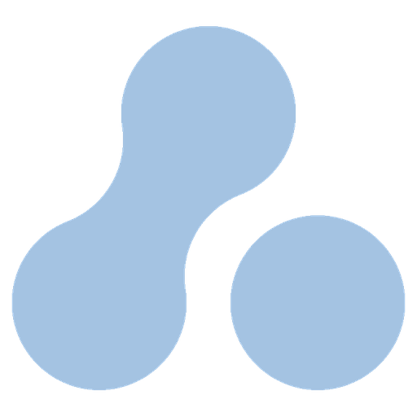

[](https://github.com/zest-zero/ancorix/actions/workflows/ci.yml)
[](LICENSE)
[](https://www.rust-lang.org)
[](https://github.com/zest-zero/ancorix)

## What is ancorix?

A graphics framework for desktop applications, 2D games and visualisations.
It sits directly on Vulkan, with a thin enough layer between your code and the
GPU that you can read all of it, and it draws shapes, sprites and text while
handling the window, the clock and the input around them.

It is not an engine: no editor, no scene tree, no entity system, no project
format to adopt. You write a struct, you get a callback once per frame, and
inside it you say what should be on the screen.

```rust
use ancorix::prelude::*;

struct Demo {
    pos: Vector2,
}

impl App for Demo {
    fn init(ctx: &mut Ctx) -> Self {
        Self { pos: ctx.window.size() / 2.0 }
    }

    fn frame(&mut self, ctx: &mut Ctx) {
        ctx.draw.clear(Rgba::WHITE);
        ctx.draw.rect(
            Rect { pos: self.pos - 100.0, size: v2!(200.0) },
            Rgba::CYAN,
        );
    }
}

fn main() {
    Window::new("demo", 1280, 720).run::<Demo>();
}
```

That is `examples/01_rect.rs` from top to bottom - not an excerpt.

Early days: the API changes between versions.

## Features and advantages

- **Immediate mode.** Nothing is retained between frames. There is no handle
  to update, no node to remove, no state that survives a frame and surprises
  you in the next one - what you draw this frame is exactly what is on the
  screen, and the order you draw it in is the order it lands in.
- **No hidden state.** No global "current colour" or "current transform" to
  set and forget. A shader or a clip region is a closure, and it ends where
  the closure ends.
- **No C dependencies.** Image decoding, font rasterising, layout and the
  binary asset format are all pure Rust, so there is nothing to install and
  nothing to cross-compile. Even Vulkan is not linked - the loader is opened
  at run time, which leaves `libc`, `libm` and `libgcc_s` in `ldd` and
  nothing else.
- **Thin structures.** A primitive holds geometry and nothing more; the
  transform is a separate `Transform2D` you pass to the `_ex` variants. Types
  are `Copy`, constructors are `const fn`, and the frame loop does not
  allocate.
- **Shaders you can actually write.** A rect is a canvas and a shader decides
  what fills it. The engine supplies the vertex stage, so what you write is a
  single function, against a shape library that gives every shape you define
  coverage, outlines, glow and boolean operations for free.
- **Layered crates.** Input knows nothing about windowing, the Vulkan layer
  knows nothing about winit, and no windowing type appears in the public API.
  Each crate does one thing and the dependencies point one way.

## Get started

```toml
[dependencies]
ancorix = { git = "https://github.com/zest-zero/ancorix" }
```

Stable Rust, 1.90 or newer. The only other requirement is a Vulkan driver.
Nothing in the code is platform-specific, and CI compiles it and runs its
tests on Linux, Windows and macOS.

```sh
sudo dnf install mesa-vulkan-drivers   # or your vendor's driver
cargo run --example 01_rect
```

**Draw a shape**

```rust
ctx.draw.circle(Circle::new(pos, 60.0), Rgba::CYAN);
ctx.draw.rounded_rect(card, Rgba::PURPLE);
ctx.draw.line(Line::new(a, b, 4.0), Rgba::WHITE);
```

**Show a picture**

```rust
// once, in init
let logo = ctx.assets.texture(include_bytes!("logo.png"));

// every frame
ctx.draw.sprite(logo, Sprite::from_center(pos, v2!(256.0)));
```

**Read the keyboard.** Bind names once, ask by name afterwards, and the keys
stop being scattered through the code:

```rust
ctx.input.bind_keys("left", &[Key::Left, Key::A]);

let dir = ctx.input.action_vector("left", "right", "up", "down");
self.pos += dir * SPEED * ctx.time.dt();
```

**Run a game loop.** There is none to write. `frame` is called once per frame
and `ctx.time.dt()` is how long the last one took. Physics that must not
depend on the frame rate gets its own fixed step:

```rust
while let Some(step) = ctx.time.fixed_tick(60.0) {
    world.advance(step);
}
```

**Write a shader.** In Slang, against the shape library in `ancorix_slang`:

```slang
import ancorix;

float4 pixel(Surface s) {
    let ring = Circle(s.size.x * 0.4).subtract(Circle(s.size.x * 0.2));
    return s.color.fade(ring.coverage(s.local));
}
```

```rust
// in init
let donut = ctx.assets.shader(include_bytes!("donut.frag.spv"));
// in frame
ctx.draw.shader(donut, Rect::from_center(center, v2!(320.0)), Rgba::CYAN);
```

## Contributing

Issues and pull requests are welcome. Read
[CONTRIBUTING.md](CONTRIBUTING.md) first - it describes how the workspace is
laid out and which conventions the code follows, and a patch that ignores
them will be sent back for changes rather than merged.

## License

MIT.
